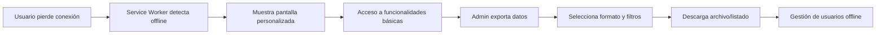
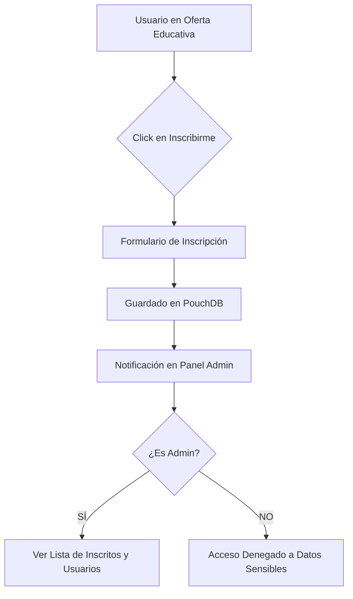
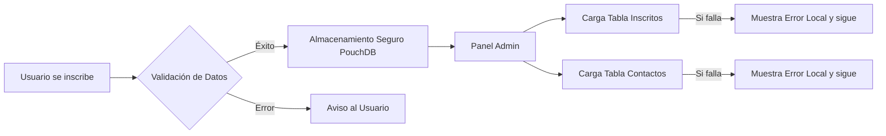
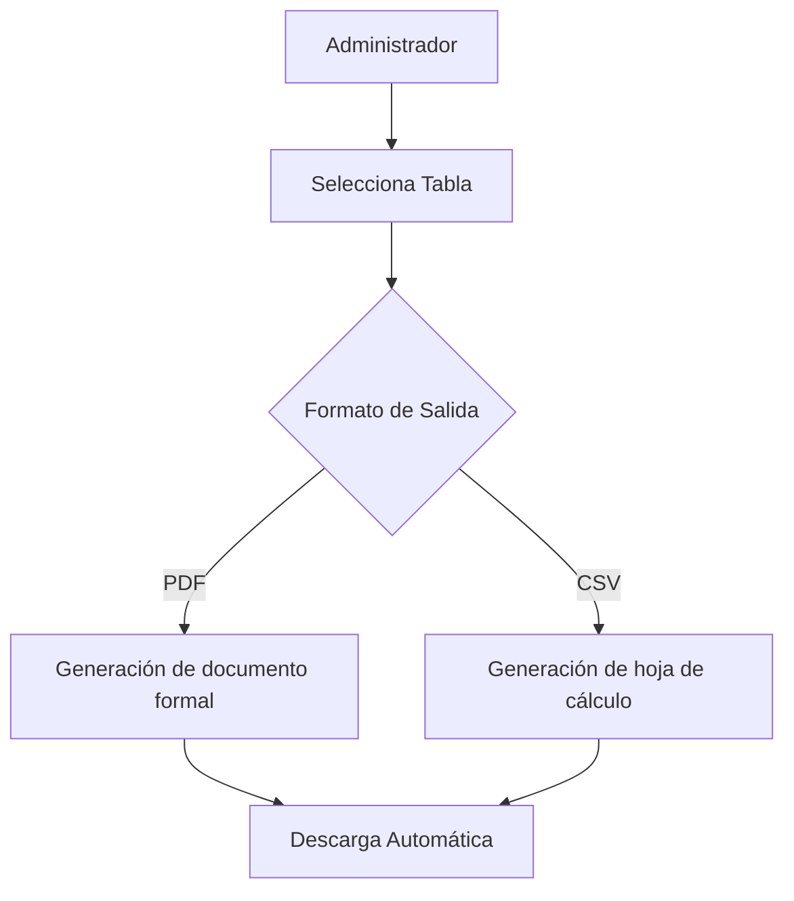

<h1 align="center">
  <ins><b>Prototipos</b></ins>
</p>
<h1 align="center">VERSION 1.1</h1>
<p align="center">Prototipos en html para el desarrollo de la Web de Red Educativa Mexico.</p>

# Descripcion del proyecto. 
Red Educativa Mexico es una plataforma web integral para servicos educativos, especificamente enfocada en la evaluacion ycertificacion  de competencias bajo el acuerdo 286
de la sep, el sistema permite explorar carreras, solicitar informacion, gestionar contactos/dudas mientras que el administrador gestiona los registros desdeun panel.
# Caracteristicas prncipales. 
## Para usuarios. 
> Pagina principal(index.html).
- Sitio web responsivo con diseño moderno y tema claro y oscuro.
- Navegacion de pagina unica con tranciciones suaves, entre secciones.
- Oferta educativa completa con 10 carreras.
- Carrusel interactivo para mostrar las carreras destacadas. 
- Sistema de busqueda y filtrado  de carreras.
- Modal de detalles con informacion sobre cada carrera. 
- Gestion de sucursales.
- Formulario de contacto con validacion.
- Seccion de noticias.
- Informacion detallada sobre el acuerdo 286.

## Para administrador.
> Panel(admin.html).
- Panel de control.
- Gestion de contactos recibidos desde el formulario. 
- Sistema de estados (pendiente, revisado y deshabiulitado).
- Glosario contextual.
- Exportacion.

## Sistema de authenticacion.
> Login(login.html).
- Registro e inicio secion de usuarios.
- Redireccion autoamtica e el panel del administrador.

# Tecnologias utilizadas.
## Frontend.
- Html5 estructura.
- Css estilos con variables css. 
- Java script interactividad y logica. 
- Pouchdb base de datos en el navegador local. 
- Front awesome iconografia.

## Caracterusticas tecnicas.
- Diseño responsivo.
- Modo claro y oscuro. 
- Validacion de formularios.
- Scroll suave.
- Optimizacion de rendimiento. 


# Instalacion y uso.
## Requisitos.
- Navegador web actual. 
- Conexion a internet.

## Credenciales de prueba. 
- Email: admin@gmail.com
- Contraseña: admin123

# Configuracion.
## Personalizacion. 
- Logo de la empresa. 
- Colores modificables en las variables en root: 

## Case de datos.
### El prototipo utlliza pouch db como almavenamiento local.
- rem-contactos: Almacena formularios de contacto.
- rem-users: Almacena credenciales de administradores.

# Seccione del sitio.
## Inicio.
- Hero section.
- Carrusel con carreras destacadas.
- Grid de noticias recientes.
- Informacion sobre ruta286.

## Nostros.
- Mision, vision y valores.
- Historia institucional.
- Logros.

## Oferta Educativa.
- 10 Carreras categorizadas.
- Sistema de busqueda y filtrado.
- Modal con detalles.

## Ruta 286/ acuerdo 286.
- Explicacion mas detallada del acuerdo.
- Beneficios y requisitos.
- Proceso  de implementacion. 

## Suscursales. 
- 4 Ubicaciones. 
- Informacionde contacto por cada sucursal. 
- Horarios de atencion.

## Noticias.
- Listado de articulos. 
- Diseño tipo tarjetas.

## Contacto.
- Formulario con validacion. 
- Informacion de contacto.
- Enlaces a redes sociales. 

# Roles de usuario.
## Visitante.
- Explorar carreras. 
- Leer noticias u articulos. 
- Consultar informacion de contacto. 
- Enviar solicitudes de informacion.

## Administrador.
- Gestionar contactos recibidos. 
- Cambiar estados de solicitudes. 
- Ver estadisticas de contacto.
- Acceder a mensajes completos.

# Base de datos local.
## Estructura de documentos. 
> **Contactos**
```json
{
  "_id": "contact_TIMESTAMP",
  "nombre": "Nombre completo",
  "email": "correo@ejemplo.com",
  "status": "pendiente|revisada|deshabilitada",
  "createdAt": "ISO fecha"
}
```
> **Usuarios**
```json
{
  _id: "user_EMAIL",
  name: "Nombre completo",
  email: "correo@ejemplo.com",
  passwordHash: "hash_sha256",
  createdAt: "ISO fecha"
}
```
# Compatibilidad.
- Chrome.
- Firefox. 
- Safari.
- Edge.
- Opera. 
- Dispositivos moviles. 

# Licencia.
Este proyecto es de uso institucional para Red Educativa Mexico. todos los derechos reservados. 

# Soporte.
Para soporte tecnico. 
- Email: admin@rededucativamexico.org
- Telefono: 800 0440 189
- Horarios: lunes a sabados 9:00 a 18:00 hrs 

<h1 align="center">VERSION 1.2</h1>

# Nuevas Caracteristicas.
## Service worker.
> He implementado un service worker que lo transforma en una pwa (progresive web app) con las siguientes capacidades. 
- Pantalla offline personalizada: cuando los usuarios pierden conexion a internet,  ahhora ven una  pantalla personalizada diseñada especificamente para esta situacion, en lugar del mensaje generico del navegador.
- Cache inteligente: los recursos encenciales de la aplicacion se almacenan en el cache para: 
  - Cargas mas rapidas en vistas posteriores.
  - Funcionalidades sin internet.
  - Experiencia de usuario mejorada. 

# Panel de administracion mejorado.
> Mejor gestion  de usuarios.
> El panel de administracion ha sido ampliado con: 
- Vista completa de usuarios registrados: visualizacion tabular con paginacion.
- Gestion granular de usuarios:
  - Activacio/desactivacion de cuentas.
  - Modificacion de roles.
  - Reset de contraseñas.
  - Eliminacion de usuarios. 

> Sistema de exportacion de datos. 
Nueva funcion de exportacion de datos. 
- Exportacion de contactos.
  - Formato csv.
  - Listado completo de contactos registrados. 
-Exportaciond de usuarios Registrados.
  - Formato csv.
  - Listado completo de usuarios registrados. 
# Pantalla ofline  personalizada.
Diseñe una interfaz especifica para el modo ofline esta incluye: 
- Indicador visual del estado de la coneccion. 
- Boton de accion para actualizar.


# Configuración Técnica.

## Service Worker.

```javascript
// Estructura básica del Service Worker
self.addEventListener('install', (event) => {
  // Instalación y caché de recursos
});

self.addEventListener('fetch', (event) => {
  // Manejo de solicitudes y respuestas offline
});

self.addEventListener('activate', (event) => {
  // Limpieza de cachés antiguos
});
```

## Endpoints de exportacion. 

```http
GET /api/export/contacts?format=csv|json|pdf
GET /api/export/users?format=csv|json&filter=active
POST /api/export/schedule (exportaciones programadas)
```
# Como probar estas nuevas funciones. 
## Experiencia offline.
#### En Chrome DevTools:
1. Ir a Application > Service Workers.
2. Marcar "Offline".
3. Recargar la página para ver la pantalla personalizada.

## Exportacion de datos.
### Como administrador.
> Ir al panel de administrsdor. 
1. Ir a panel administrador > usuarios. 
2. Hacer click en exportar.
3. Se descarga el archivo csv. 

# Métricas Implementadas.

| Características | Beneficios | Impacto |
| :--- | :--- | :---: |
| **Service Worker** | reducción de tiempos de espera | Alto |
| **Pantalla Offline** | eliminación de errores de conexión | Medio Alto |
| **Exportación CSV** | reducción de reportes mensuales | Alto |
| **Gestión de Usuarios** | eficiencia en gestión | Medio |

# Flujo de trabajo mejorado.




# Solucion de problemas comunes.
## Service worker no se registra.
> Soluciones:
1. Verificar HTTPS en producción.
2. Limpiar caché del navegador.
3. Verificar ruta del service worker.

# Soporte.
Para problemas relacionados con las nuevas funciones.
1. Verifica la conexion a internet para el service worker. 
2. Revisa la consola de navegador para errores especificos.


<h1 align="center">VERSION 1.3 </h1>

# Nuevas caracteristicas y mejoras.
## Sistema de inscripciones.
> Ahora los usuarios no solo pueden consultar la oferta educativa si no iniciar su proceso directamente desde la plataforma. 
- Flujo de inscripcion: se agrego un boton de "inscribirme" en cada una de las 10 carreras dentro dekl modal de detalles. 
- Captura de datos: formulario integrado que vincula al usuario interesado con la carrera especifica seleccionada.
- Persistencia en base de datos: Las inscripciones se almacenan en un nuevo almacen de pouchdb con su gestion posterior.

## Seguridad y resticcion de roles.
Hemos reforzado los datos sencibles del sistema.
- Privacidad de usuario: se implemento un middleware de validacion sonde solo el usuario con rol administrador tiene acceso a la seccion de "usuarios Registrados". 

## Panel de administracion 2.0.
- Gestion de inscritos: nueva seccion para visualizar y dar seguimiento a las solicitudes de inscripcion a carreras.
- Filtro por carrera: Capaciodad de filtrar inscritos segun la licenciatura o certificacion.

# Configuracion tecnica actualizada.
## Estructura de inscripciones (base de datos).
```json
{
  "_id": "inscription_TIMESTAMP",
  "user_id": "ID_DEL_USUARIO",
  "carrera_id": "NOMBRE_O_ID_CARRERA",
  "fecha_solicitud": "ISO fecha",
  "estatus": "pendiente | en proceso | completado"
}
```
# Control de acceso logica.

```javascript
// Lógica de restricción implementada
if (user.role !== 'admin') {
    hideUserManagementSection();
    restrictAccessTo('/admin/users');
}
```
# Flujo de inscripcion y gestion.


# Metricas de la version 1.3.

| Características | Beneficios | Impacto |
| :--- | :--- | :---: |
| **Modulo de inscripcion** | Conversion directa a alumnos | Alto |
| **Restruiiccion de roles** | Mayor seguridad  | Muy Alto |
| **Gestion de inscritos** | reducción de reportes mensuales | Alto |


<h1 align="center">VERSION 1.5</h1>

# Optemizacion y correccion de errores 
> En esta actualizacion se sentro en la estabilidad de los prototipos resolviendo conflictos criticos en la persistencia de datos y mejorando  la integridad visual, del panel administrador 

## Correccion en el sistema de suscripciones 
Se detectaron y solucionaron problemas en el ciclo de vida del registro de inscripciones los cuales afectaban la base de datos:
- **Sincronizacion de PouchDB** Se cirrigio el conflicto de guardado que en ocaciones bloqueba el registro de todo lo demas en la base de datos 
- **Validacion de campos** Se mejoro la captura de datos en el formulario de inscipcion, para asegurar que contenga la informacion necesaria antes de ser enviada a el almacenamiento local 

## Mejoras en la vista de administrador
Se realizo un reestructuracion en la logica de renderizado del panel para evitar errores de visualizacion.
- **Reparacion de tablas** Se soluciono el problema en el script que carga que causaba el conflicto entre tablas ocacionando que no se visualizaran dichas tablas.
- **Independencia de modulos** A hora cada seccion administrativa carga de forma independiente. si un registro tiene un error de formato, el resto de la informacion sigue siendo visible y funcional. 
- **Depuracio  UI** Limpieza de elementos que se visualizan que se ensiman o no respondian correctamente tales como la navbar con la sidebar. 

# Detalles tecnicos de la version 1.5

## Logica de renderizado seguro 
Se implementaron bloques `try-catch` en la lectura de base de datos para garantizar que el panel no se rompa.

```javascript
async function loadAdminTables() {
    try {
        await loadInscripciones();
    } catch (error) {
        console.error("Error al cargar inscripciones:", error);
        showTableErrorMessage('inscriptions-container');
    }
    
    await loadContacts(); 
    await loadUsers();
}
```

# Impacto de Mejoras

| Características | Solucion aplicada | Estado |
| :--- | :--- | :---: |
| **Bloqueo de tablas generales** | Renderizado Modular indeoendiente | Corregido |
| **Fallo en registro de inscipciones** | Optimizacion de promesas en pouchdb | Corregido |
| **Incosistencia de Datos** | Limpieza de esquemas en el almacenamiento | Corregido |


# flujo de correccion de datos




<h1 align="center">VERSION 1.7</h1>
 
# Rediseño de interfaz y Reportes 
> En esta version nos enfocamos en la experiencia de usuario (UX) y la identificacion visual, renovando los puntos criticos de interaccion y añadiendo capacidades de reportes 

## esportaciones PDF 
Se han implementado una de las funciones mas escenciales para la  gestion administrativa 
- **Reportes Dinamicos** ahora es posible exportar los listado de comtactos, usuarios y inscripciones directamente a pdf.
- **Formato profecional** los documentos generados incluyen el membrete de red educativa Mexico, tablas organizadas y fechas de generacion, ideales para impresion de archivos fisicos 

## rediseño visual (UI/UX)
se realizo una actualizacion estetica para mejorar la legibilidad y modernidad del sitio 
- **Nuevo login** la pantalla de acceso fue rediseñada para ser mas limpia y segura con mejores validaciones visuales y un estilo minimalista 
-- **panel de administracion 3.0**  - layout optimizado para aprovechar mejor el espacio de la pantalla 
  - icnonografia actualizada y paleta de colores corregidos para reducir la fatiga visual. 
  - tablas de datos mas fluidas y responsivas. 
- **ajustes de diseñogeneral** se corrigieron detalles de espaciado (padding/margin), tipografias y sombras en toda la plataforma, para un acabado mas pulido

# Detalles tecnicos de la version 1.7
## implementacion de la exportacion 
> se integro logica de renderizado que convierte los datos de pouchdb en estructuras listas en pdf.

```javascript
// Estructura lógica para la generación de reportes
async function exportToPDF(data, title) {
    const doc = new PDFDocument();
    doc.header('Red Educativa México - Reporte Oficial');
    doc.table(data); // Renderizado de tablas desde la BD local
    doc.save(`${title}_${Date.now()}.pdf`);
}
```

# comparativas visuales 

| Modulo | Antes | Ahora 1.7 |
| :--- | :--- | :---: |
| **Login** | funcional basico | interfaz moderna pero minimalista |
| **Admin Panel** | tablas densas y rigidas  | diseño fluido y gestion de espacios |
| **Reportes** | solo visualizacion y esportar en csv | EXportacion e pdf |
| **Estilos** | Variables estandar | diseño premium corregido |

# Flujo de generacion de reportes 


  
  # guia de estilos actualizados 
  - colores primarios actualizados para cumplir estandares de accesibilidad 
  - componentes: se entandarizaron los botones y campos de entrada, login y administrador para mantener coherencia visual en todo el proyecto 

<h1 align="center">VERSION 1.8</h1>

# se hizo reiseño a el apartado de administrador, login, pantalla de offline y pantalla de error 

<h1 align="center">VERSION 2.0</h1>

# quedo establecido todo el resieño de la web 

